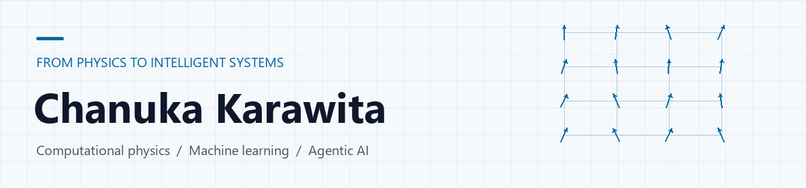

<picture>
  <source media="(prefers-color-scheme: dark)" srcset="assets/physics-to-ai-dark-unlabelled.gif">
  
</picture>

# Chanuka Karawita

**AI Engineer · Agentic AI · Computer Vision** 
Colombo, Sri Lanka

I’m an AI engineer with a background in computational physics, building agentic AI workflows, computer vision applications, and cloud-based machine learning systems. My research explores phase transitions and how learning behaviour shapes complex networks.

[Email](mailto:cu9428@gmail.com) · [LinkedIn](https://linkedin.com/in/chanuka-karawita-105319111) · [Research](https://link.springer.com/article/10.1007/s13278-025-01512-0)

## What I've worked on

- **Agentic AI:** Built multi-agent LLM workflows with LangGraph and CrewAI, internal MCP servers, and AWS Bedrock AgentCore integrations at **DartxTool Pty Ltd**.
- **Computer vision:** Developed real-time video analytics with NVIDIA DeepStream and YOLO at **Booleanlabs**.
- **Visual representation learning:** Worked on contrastive learning, image processing, and controllable image generation using StyleGAN2-ADA and GANSpace at **Pekoe.ai**.

## Selected projects

### [Learning Rate Heterogeneity](https://github.com/chanukauk/Learning_Rate_Heterogeneity_in_Bounded_Rationality)

Explore how differences in learning rates influence the structure of socio-economic networks. Research code connects bounded rationality, adaptive networks, and emergent behaviour.

`Python` · `Network science` · `Quantal Response Equilibrium` 
[Read the paper →](https://link.springer.com/article/10.1007/s13278-025-01512-0)

### [ShallowXception](https://github.com/chanukauk/ShallowXception)

A shallow Xception-based architecture with selectable depths and pretrained weight transfer for image classification.

`Python` · `TensorFlow` · `Computer vision`

### [Monte Carlo · 3D Heisenberg Model](https://github.com/chanukauk/Monte-Carlo-Simulation-for-the-3D-Heisenberg-Model)

Monte Carlo simulation of the 3D Heisenberg spin model, connecting numerical methods with statistical physics.

`C++` · `Monte Carlo simulation` · `Computational physics`

## Research & education

**[Exploring Emergent Topological Properties in Socio-Economic Networks through Learning Heterogeneity](https://link.springer.com/article/10.1007/s13278-025-01512-0)** 
*Social Network Analysis and Mining* · 16, Article 16 (2026) · [Preprint](https://arxiv.org/abs/2510.24107)

**[Machine-learning-assisted Classification of Thermodynamic Phases in the Classical Heisenberg Antiferromagnet on a Triangular Lattice](https://science.cmb.ac.lk/icmas2021/wp-content/uploads/2021/12/Conference-Proceedings-ICMAS-2021.pdf)** 
Conference abstract · ICMAS 2021

**BSc (Special) in Computational Physics** · University of Colombo

## Toolkit

**Languages & development**

  &ensp;
  &ensp;
  &ensp;
  &ensp;
  &ensp;
  &ensp;

**AI & computer vision**

  &ensp;
  &ensp;
  &ensp;
  &ensp;
  &ensp;
  &ensp;

**Cloud & infrastructure**

  &ensp;
  &ensp;
  &ensp;
  &ensp;
  &ensp;
  &ensp;

**AWS services**

<table>
  <tr>
    <td align="center"> Bedrock AgentCore</td>
    <td align="center"> SageMaker</td>
    <td align="center"> Lambda</td>
    <td align="center"> EC2</td>
    <td align="center"> S3</td>
    <td align="center"> DynamoDB</td>
  </tr>
  <tr>
    <td align="center"> Textract</td>
    <td align="center"> API Gateway</td>
    <td align="center"> RDS</td>
    <td align="center"> Batch</td>
    <td align="center"> App Runner</td>
    <td></td>
  </tr>
</table>

### AWS & cloud deployment

- **Agentic AI:** Amazon Bedrock AgentCore for deploying agentic applications.
- **Model training:** Amazon SageMaker.
- **Compute & deployment:** AWS Batch, App Runner, Lambda, and Amazon EC2.
- **Containers & infrastructure as code:** Docker and Terraform.
- **Storage, APIs & databases:** Amazon S3, API Gateway, Amazon DynamoDB, and RDS.
- **Document intelligence:** Amazon Textract for text and layout extraction from scanned documents.

### AI & scientific computing

- **Agent systems:** LangChain, LangGraph, CrewAI, and MCP servers for internal data sources.
- **Deep learning & vision:** PyTorch, TensorFlow, Keras, OpenCV, NVIDIA DeepStream, YOLO, CNNs, and vision transformers.
- **Data & modelling:** NumPy, SciPy, pandas, scikit-learn, statsmodels, NetworkX, and Optuna.
- **Visualisation:** Matplotlib and Seaborn.
- **Speech & NLP:** Kaldi, spaCy, NLTK, and hidden Markov models.

### Software & ML tooling

- **Languages:** Python, C++, Go, JavaScript, MATLAB, and SQL.
- **Applications & databases:** FastAPI, Angular, Ionic, MongoDB, and MySQL.
- **Development & reproducibility:** Git, Linux, Bash scripting, and DVC for dataset versioning and reproducible ML pipelines.

---

Interested in agentic AI, computer vision, or computational research? [Let's connect on LinkedIn](https://linkedin.com/in/chanuka-karawita-105319111) or [send me an email](mailto:cu9428@gmail.com).
